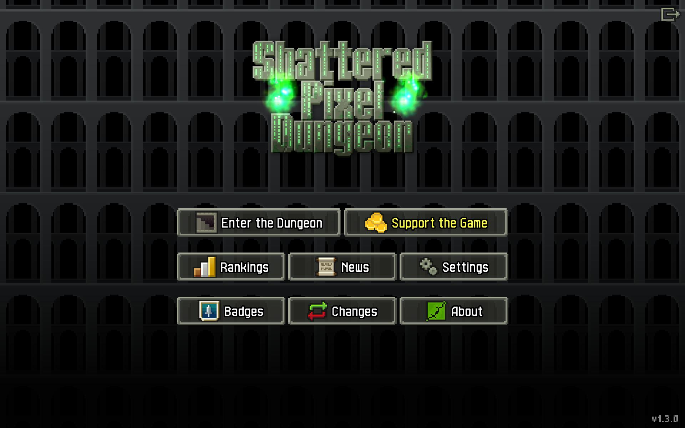
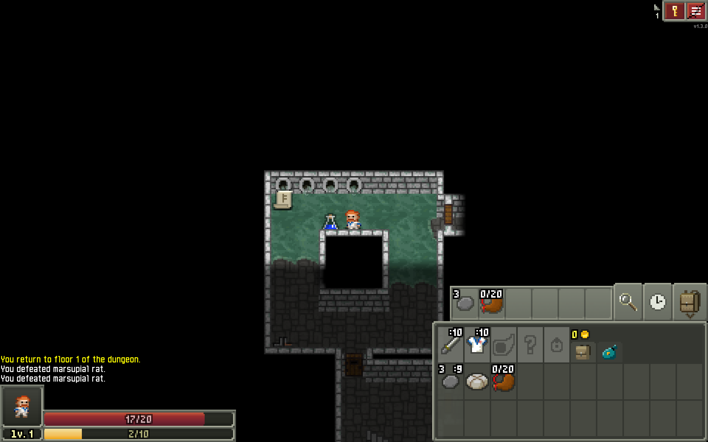
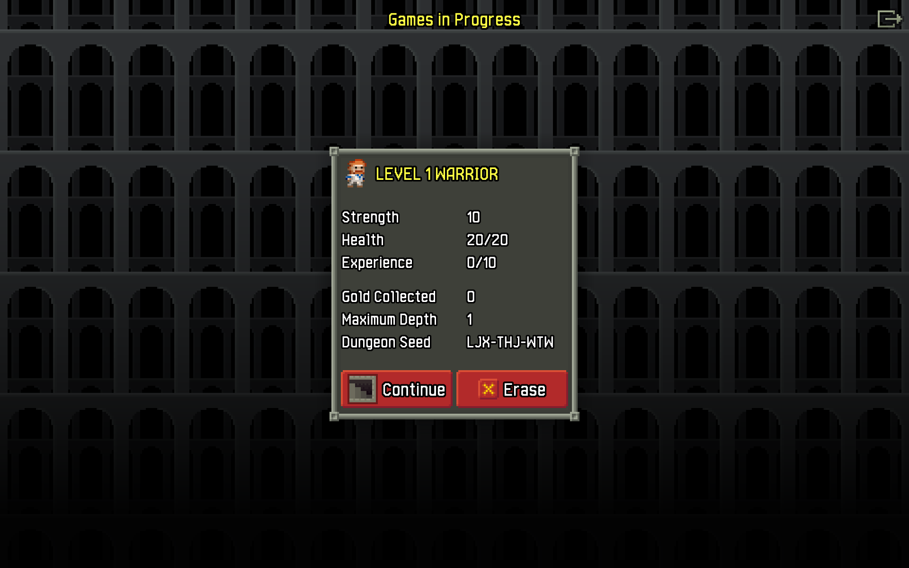

# Flathub: Shattered Pixel Dungeon

A flatpak package providing [Shattered Pixel Dungeon](https://shatteredpixel.com/).

## Description

Playing some games is fun. Packaging the [code](https://github.com/00-Evan)
from Shattered Pixel Dungeon and maintaining it is fun, too.

### Game description

Shattered Pixel Dungeon is a Roguelike RPG, with pixel art graphics and lots of
variety and replayability. Every game is unique, with four different playable
characters, randomized levels and enemies, and over 150 items to collect and
use. The game is simple to get into, but has lots of depth. Strategy is
required if you want to win!

### Screenshots

### Game Links

- [Website](https://shatteredpixel.com/)
- [Bugtracker](https://github.com/00-Evan/shattered-pixel-dungeon/issues)

## Contribute

Thank you so much for considering to contribute. We are very happy, when somebody
is joining the work. Please fell free to open
[Bugs, Feature Requests](https://github.com/flathub/com.shatteredpixel.shatteredpixeldungeon/issues)
or [Pull Requests](https://github.com/flathub/com.shatteredpixel.shatteredpixeldungeon/pulls).

## LICENSE

The package metadata is licensed under a
[CC-BY-SA-3.0](https://creativecommons.org/licenses/by-sa/3.0/) license.

The packaged program is licensed under a
[GPL-3.0-only](https://spdx.org/licenses/GPL-3.0-only.html) license.
